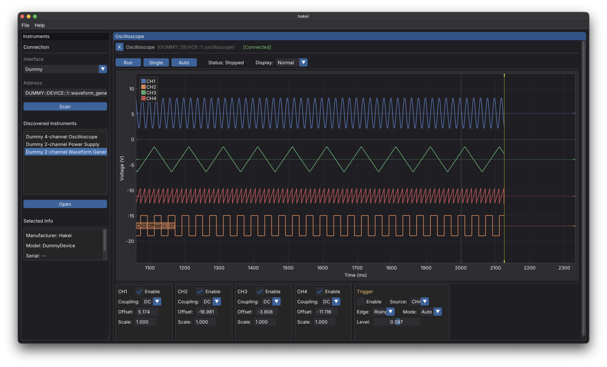

# hakei

hakei is a cross-platform control panel for laboratory instruments, built using [dearpygui](https://github.com/hoffstadt/DearPyGui). It's meant as a general purpose replacement to vendor-specific GUIs like Keysight BenchVue, National Instruments NI-SCOPE, Liquid Instruments MokuOS, etc.

> [!caution]
> hakei is in very early development and is not ready for serious use!



## Usage

### With uv (recommended)

```bash
uv run hakei
```

### With pip

```bash
python -m venv venv
source venv/bin/activate  # On Windows: venv\Scripts\activate
pip install -e .
hakei
```

## Development

### Install dev dependencies

```bash
uv pip install -e ".[dev]"
```

### Linting

```bash
uv run ruff check hakei/
uv run ruff check --fix hakei/
```

### Documentation

Generate API documentation (requires [Quarto](https://quarto.org/)):

```bash
uv run quartodoc build
quarto preview docs
```

## Concepts

### Devices vs Instruments

hakei distinguishes between **Devices** and **Instruments**:

- **Device**: A physical piece of hardware (e.g., Digilent Analog Discovery 2, a multi-function bench instrument). A device has a single connection interface and may contain multiple instruments.
- **Instrument**: A logical function within a device (e.g., oscilloscope, waveform generator, power supply). Some devices contain only one instrument (standalone instruments), while others contain multiple.

When you connect to a multi-function device, you can choose which instruments to activate at any time.

## Project Structure

```
hakei/
├── hakei/
│   ├── __main__.py           # Application entry point
│   ├── config.py             # Configuration save/load (.hakei files)
│   ├── instruments/          # Instrument abstraction layer
│   │   ├── scanner/          # Instrument discovery (VISA, Digilent, etc.)
│   │   ├── digilent/         # Digilent Waveforms SDK support
│   │   └── dummy/            # Simulated instruments for testing
│   └── ui/
│       ├── layout.py         # Tiling window manager
│       └── views/            # Instrument UI panels
├── docs/                     # Quartodoc documentation
└── pyproject.toml
```
